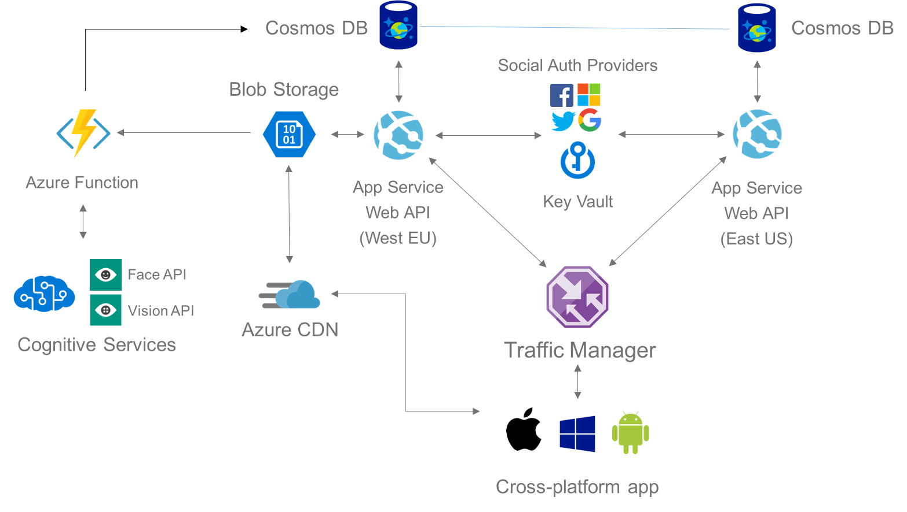

# SnapGold Demo
This cross-platform sample app demonstrates real-world social media experiences around photo sharing across iOS, Android and Windows. To ensure maximized code re-use and a rich user experience at the same time, it uses Xamarin as its cross-platform frontend framework. In the backend, it leverages several advanced Azure Services based on Azure App Services, Azure Functions and Azure Cosmos DB.

| Platform | Master | Develop | Latest Release |
|----------|--------------------------------------------------------------------------------------------------------------------------------------------------|---------|---------|
| iOS      |  |  | [Download](install.mobile.azure.com/orgs/emea-gbb/apps/snapgold-ios/distribution_groups/public) |
| Android  |  |  | [Download](https://install.mobile.azure.com/orgs/emea-gbb/apps/snapgold-android/distribution_groups/public) |

## What we did
This is a fork from the official [Appsample-Photosharing](https://github.com/Microsoft/Appsample-Photosharing) project from Microsoft, that was only targeting the Universal Windows Platform (UWP) and was based on a very simple backend architecture. We broadened its potential user base by adding an iOS and Android project and modernized the backendend to enable global scaling, high availablility and advanced workloads.

### Upgrading the solution
**Xamarin:** Take existing UWP code cross-platform to iOS, Android and Windows

**COSMOS DB:** Provide global scale delivering data with low latency anywhere in the world

**Azure CDN:** Edge caching of images for fast download

**Cognitive Servives:** Auto-tagging and description of photos to power search and auto-suggestion

**Azure Functions:** Manage tagging and updating of metadata in the backend database

**Traffic Manager:** Route client requests to the nearest Web API endpoint

**Azure Key Vault:** Manage and store certificates for secure data transfer

 ## Architecture
 
